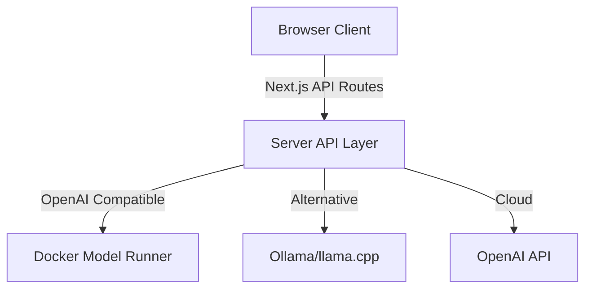

# techno-boto-chat

<div align="center">

_A Mediocre AI Chat Interface_

[](https://nextjs.org/)
[](https://typescriptlang.org/)
[](https://tailwindcss.com/)
[](https://docker.com/)

**Modern • Extensible**

[Quick Start](#quick-start) • [Features](#features) • [Docker Config](#docker-model-runner-configuration) • [Architecture](#architecture)

</div>

---

## Features

- **Dark/Light Theme** - Toggle between themes
- **Local AI Models** - Connect to Docker Model Runner, Ollama, or OpenAI
- **Markdown Rendering** - Basic text formatting and code blocks
- **TypeScript** - Type-safe code
- **Docker Support** - Run with `docker compose up`

---

## Screenshots

### Dark Mode Interface


---

## Quick Start

### Local Development

```bash
# Clone and setup
git clone git@github.com:timothystewart6/techno-boto-chat.git
cd techno-boto-chat
yarn install

# Configure environment
cp .env.example .env.local
# Edit .env.local with your configuration

# Start development server
yarn dev
# Open http://localhost:3000
```

### Docker Deployment

```bash
# One-command deployment with Docker Model Runner
docker compose up --build

# Access your chat interface at http://localhost:3000
```

---

## Docker Model Runner Configuration

`techno-boto-chat` is designed to work seamlessly with Docker Model Runner and other OpenAI compatible endpoints for local AI model hosting.

### **Running in Container (Recommended)**

When running as a containerized service, use if using Docker Model Runner, use Docker's internal networking:

```yaml
# compose.yaml
services:
  techno-boto-chat:
    environment:
      # Docker internal network - model-runner service discovery
      - LLM_API_BASE_URL=http://model-runner.docker.internal/engines/v1
      - MODEL_NAME=ai/gpt-oss

  docker-model-runner:
    provider:
      type: model
      options:
        model: ai/gpt-oss
```

### **Running Locally (Development)**

When running and developing locally with Docker Model Runner:

```env
# .env.local - For local development
LLM_API_BASE_URL=http://localhost:12434/engines/v1
MODEL_NAME=ai/gpt-oss
OPENAI_API_KEY= # Leave empty for local models
```

### **Supported Endpoints**

| Provider                | Container URL                                    | Local URL                           | Use Case                  |
| ----------------------- | ------------------------------------------------ | ----------------------------------- | ------------------------- |
| **Docker Model Runner** | `http://model-runner.docker.internal/engines/v1` | `http://localhost:12434/engines/v1` | Local AI hosting          |
| **Ollama**              | `http://ollama:11434/v1`                         | `http://localhost:11434/v1`         | Alternative local hosting |
| **llama.cpp**           | `http://llama-cpp:8080/v1`                       | `http://localhost:8080/v1`          | Direct model serving      |
| **OpenAI API**          | `https://api.openai.com/v1`                      | `https://api.openai.com/v1`         | Cloud AI services         |

---

## Architecture

### **Clean Separation Pattern**



- **Browser Client** (`lib/techno-boto-chat-client.ts`) - UI interactions via Next.js API routes
- **Server Client** (`lib/llm-client.ts`) - Direct LLM communication from server-side
- **API Routes** (`app/api/`) - Secure bridge between browser and AI models
- **Shared Utilities** - Common types and utilities across environments

### **Component Structure**

```text
app/
├── page.tsx                       # Main orchestrator
├── components/
│   ├── avatar.tsx                 # User/AI avatars
│   ├── header.tsx                 # Dynamic model info display
│   ├── message-bubble.tsx         # Individual messages
│   ├── message-content.tsx        # Message content wrapper
│   ├── message-list.tsx           # Chat container
│   ├── markdown-content.tsx       # Rich text rendering
│   ├── reasoning-section.tsx      # AI thinking display
│   ├── chat-input.tsx             # User input handling
│   ├── loading-indicator.tsx      # Typing animations
│   ├── notification-list.tsx      # Error/status alerts
│   └── theme-toggle.tsx           # Light/dark mode switcher
├── hooks/
│   ├── use-chat.ts                # Chat state management
│   ├── use-notifications.ts       # Alert system
│   └── use-theme.tsx              # Theme hook
└── contexts/
    └── theme-context.tsx          # Theme management
```

---

## Environment Configuration

### **Core Settings**

```bash
# AI Model Configuration
LLM_API_BASE_URL=http://model-runner.docker.internal/engines/v1
MODEL_NAME=ai/gpt-oss
OPENAI_API_KEY=  # Optional for local models

# Behavior Customization
NEXT_PUBLIC_SYSTEM_PROMPT_REGULAR="You are a helpful AI assistant..."
NEXT_PUBLIC_SYSTEM_PROMPT_REASONING="Think step by step, then provide..."
NEXT_PUBLIC_MAX_TOKENS_REGULAR=1000
NEXT_PUBLIC_MAX_TOKENS_REASONING=2000
NEXT_PUBLIC_ENABLE_REASONING=true

# Privacy & Security
NODE_ENV=production
NEXT_TELEMETRY_DISABLED=1
```

### **Runtime Model Switching**

Change AI models without rebuilding:

```bash
# Update environment and restart
export MODEL_NAME=ai/llama3.3-70b
docker compose restart techno-boto-chat

# Model info automatically updates in UI
```

---

## Docker Usage

### **Running with Docker**

The application is containerized for easy deployment:

```bash
# Build and deploy with Docker Compose
docker compose up --build -d

# Access your chat interface at http://localhost:3000
```

---

## Development Scripts

```bash
# Development
yarn dev             # Hot reload development server

# Building
yarn build           # Production build

# Quality Assurance
yarn lint            # ESLint on all JS/TS files
yarn lint:fix        # Auto-fix linting issues
yarn lint:yaml       # YAML file linting
yarn type-check      # TypeScript compilation check
yarn test            # Run Jest tests
yarn ci              # Complete CI pipeline (lint + test + build)

# Docker Operations
docker compose up --build    # Build and run with model runner
docker compose logs -f       # Follow container logs
```

---

## Advanced Features

### **AI Reasoning Support**

Compatible models can show their thinking process:

```typescript
// Enable reasoning mode
const response = await client.generateChatResponseWithReasoning(
  userMessage,
  systemPrompt,
  { maxTokens: 2000 }
)

// Display reasoning in collapsible section
<ReasoningSection
  reasoning={response.reasoning}
  isVisible={showReasoning}
/>
```

---

## Tech Stack

| Technology       | Version | Purpose          | Benefits                          |
| ---------------- | ------- | ---------------- | --------------------------------- |
| **Next.js**      | 15.x    | React Framework  | Server Components, App Router     |
| **TypeScript**   | 5.x     | Type Safety      | Enhanced DX, Runtime Safety       |
| **Tailwind CSS** | 3.x     | Styling          | Utility-first, Responsive         |
| **React**        | 19.x    | UI Library       | Modern Hooks, Concurrent Features |
| **Docker**       | Latest  | Containerization | Consistent Deployments            |

---

## License

**MIT License** - Feel free to use, modify, and distribute this project!

---

## Contributing

We welcome contributions! This project demonstrates:

- **Modern Next.js patterns** - App Router, Server Components
- **Clean Architecture** - Separation of concerns, modular design
- **Advanced UI patterns** - Light/dark theme system, component composition
- **Production practices** - Docker, TypeScript, testing

Perfect for learning modern React development patterns!

---
